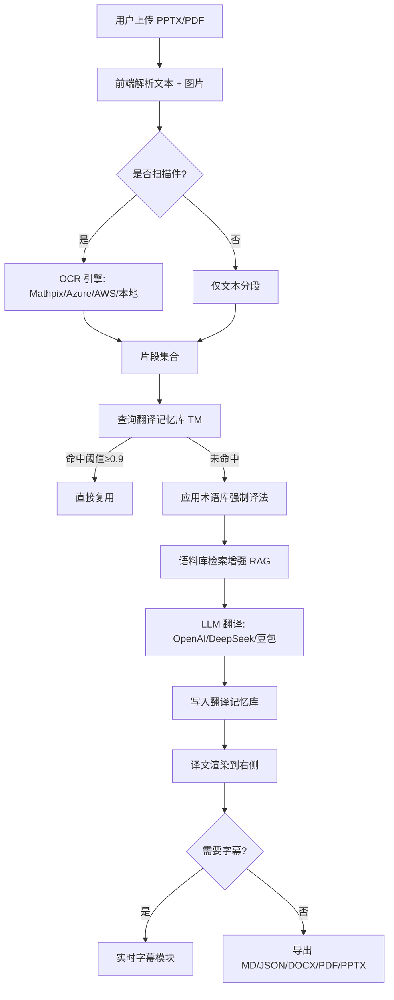

# Vibe Translate · 产品需求文档 (PRD)

## 1. 产品概述
Vibe Translate 是一款基于浏览器的「一键 PPT / PDF 翻译工具」，融合 OCR、多模型翻译、翻译记忆库、语料库、术语库与实时字幕，让用户上传一份英文演示文稿即可在 30 秒内得到一份结构完整、术语一致、可二次编辑的中文版本。
- 目标用户：跨境咨询/培训/学术汇报的演讲者、产品经理、运营、翻译初学者。
- 差异化：把"翻译记忆 + 语料 + 术语"打包为浏览器端 SaaS，免安装、可分享链接、可导出多格式。

## 2. 核心功能

### 2.1 用户角色
| 角色 | 注册方式 | 核心权限 |
|------|----------|----------|
| 访客 | 无需注册 | 上传文件、配置 API、查看译文、导出 |
| 注册用户 | 邮箱/Google | 云端保存术语库、语料、翻译记忆、任务历史 |

### 2.2 功能模块
1. **首页（工作台）**：上传区 / 语言切换 / OCR 选择 / 开始翻译 / 实时字幕入口
2. **配置中心**：API Key 多供应商管理、模型选择、提示词模板
3. **翻译记忆库 (TM)**：自动积累原文-译文 pair，相似度匹配复用
4. **语料库 (Corpus)**：内置行业语料，支持上传 CSV/JSON 进行检索增强
5. **术语库 (Glossary)**：手动维护指定译法，翻译时强制替换
6. **任务中心**：历史任务、状态、导出文件
7. **实时字幕**：浏览器麦克风 / 视频 / 摄像头三路输入 → 语音识别 → 翻译 → 双语字幕叠加

### 2.3 页面与模块详表
| 页面 | 模块 | 功能描述 |
|------|------|----------|
| 工作台 | 上传卡片 | 拖拽或点击选择 .pptx/.pdf，文件预览、解析进度 |
| 工作台 | 语种 | 中↔英、日↔中、英↔中、韩↔中 多向切换 |
| 工作台 | OCR | 自动 / Mathpix / Azure AI / AWS Textract / 本地 Tesseract / 仅文本 |
| 工作台 | API Key | 翻译优先 (auto/openai/deepseek/doubao) + 4 个供应商 Key |
| 工作台 | 开始翻译 | 解析 → 分段 → 查 TM → 查术语 → 调模型 → 渲染 |
| 工作台 | 译文预览 | 双栏对照、按页签切换、原文高亮命中术语 |
| 工作台 | 导出 | MD / JSON / DOCX / PDF / 原版回写 PPTX |
| 翻译记忆 | 列表 | 来源文件、原文、译文、置信度、采纳数 |
| 翻译记忆 | 检索 | 输入原文返回 Top-3 匹配项，可一键复用 |
| 语料库 | 内置 | 商务 / 学术 / IT 行业语料示例 |
| 语料库 | 上传 | CSV/JSONL 解析，统计词频 |
| 术语库 | 编辑 | 表格 CRUD、批量导入、强制生效开关 |
| 实时字幕 | 输入源 | 麦克风 / 视频 / 文件音频 / 摄像头 |
| 实时字幕 | 字幕面板 | 上原文下译文，可调字体、字号、位置 |
| 任务中心 | 列表 | 状态机 (待开始/进行中/已完成/失败)，可重试 |
| 登录页面 | 表单 | 邮箱密码登录、密码可见切换、错误提示、跳转注册 |
| 注册页面 | 表单 | 昵称/邮箱/密码/确认密码、表单验证、自动登录、跳转登录 |

## 3. 核心流程

## 4. 用户界面设计

### 4.1 设计风格
- **主色调**：墨绿 `#1F7A5A`（品牌）+ 米白底 `#FBFBF4`（内容）+ 浅灰 `#E8E6DE`（分隔）
- **辅助色**：深炭 `#1C1C1C`、警示橙 `#E07A3F`、成功绿 `#3FB47B`
- **字体**：标题 Fraunces（衬线、有书卷气）/ 正文 Inter Tight / 代码 JetBrains Mono
- **按钮**：圆角 12px，主按钮 1px 黑色描边 + 阴影；次按钮白底浅边框
- **布局**：12 栅格桌面端优先，左侧 360px 控制台 + 右侧自适应 + 底部全宽术语库
- **图标**：Lucide，统一 1.5px 描边
- **动效**：进入 `opacity 0→1 + translateY 8px→0`，缓动 `cubic-bezier(.2,.7,.2,1)` 420ms

### 4.2 页面设计要点
| 页面 | 模块 | UI 元素 |
|------|------|----------|
| 工作台 | 上传 | 256×160 虚线框，悬停加深边框、内嵌"点击上传"副标题 |
| 工作台 | 语种 | 2 个胶囊 Tab 互斥，激活时墨绿底白字 |
| 工作台 | OCR | 6 个芯片，2×3 网格，选中态墨绿描边 |
| 工作台 | API Key | 紧凑列表 + 输入框圆角 8px，悬浮提示文案 |
| 译文预览 | 顶部 | 4 个导出按钮 + "等待上传"占位图标 |
| 术语库 | 表格 | 表头灰色，行高 48，悬浮高亮墨绿 4% 透明 |

### 4.3 响应式
- ≥1280：左 360 / 右自适应
- 1024–1280：左 320，控制按钮由 2 列变 3 列
- <1024：折叠侧边为顶部抽屉
- <640：单列堆叠

### 4.4 3D 场景指引
不适用（本项目为工具型 Web 应用，聚焦效率与清晰度）。

## 5. 非功能性需求
- **性能**：30 页 PPT 首屏渲染 < 2s，翻译阶段 200ms 流式回显。
- **隐私**：API Key 仅存 localStorage，不上传服务器。
- **可扩展**：所有 Provider 通过统一 `Translator` 接口实现，可热插拔。
- **离线**：纯文本翻译（浏览器内 Intl 词典）作为兜底。
