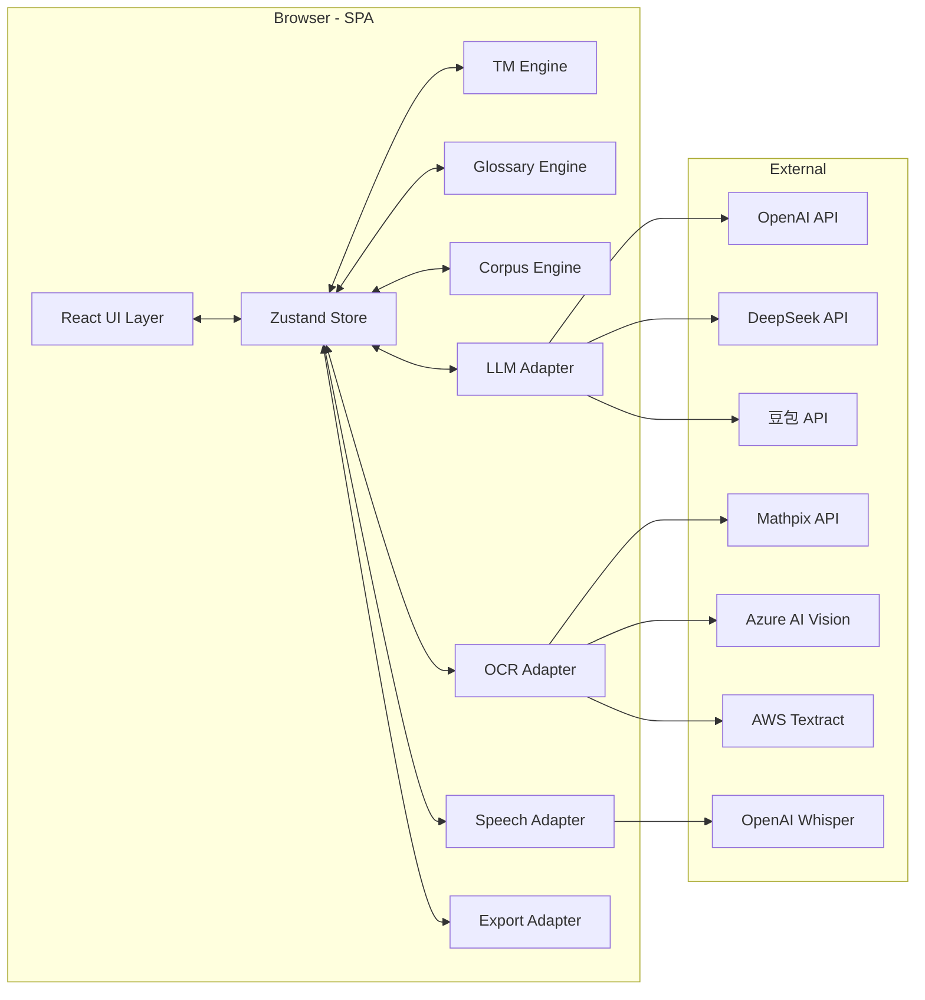
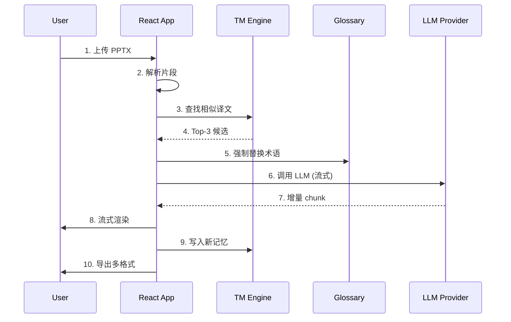

# Vibe Translate · 技术架构文档

## 1. 架构设计



## 2. 技术选型
- **前端**：React 18 + TypeScript + Vite 5 + Tailwind CSS 3 + Zustand
- **PDF 解析**：pdfjs-dist
- **PPTX 解析**：jszip + 自实现 XML 解析（不依赖服务器）
- **DOCX 导出**：docx
- **PDF 导出**：jspdf + html2canvas
- **OCR**：Tesseract.js（本地兜底）+ Mathpix / Azure / AWS 远程
- **语音识别**：Web Speech API（浏览器原生）+ 可选 OpenAI Whisper API
- **样式**：Tailwind + CSS Variables，遵循 4px 栅格
- **图标**：lucide-react
- **部署**：Vercel（首选）/ Netlify / 自定义域名 CNAME

## 3. 路由定义
| Route | 用途 |
|-------|------|
| `/` | 工作台：上传 / 配置 / 译文预览 / 实时字幕 |
| `/memory` | 翻译记忆库管理 |
| `/corpus` | 语料库管理 |
| `/glossary` | 术语库管理 |
| `/tasks` | 任务中心与历史 |

> 为减少首次进入阻力，主界面采用单页多区域（顶部 Tab + 底部抽屉）切换，避免多页跳转造成上下文丢失。

## 4. 核心模块 API 定义

### 4.1 统一翻译接口
```ts
interface Translator {
  id: 'openai' | 'deepseek' | 'doubao' | 'mock';
  translate(input: TranslateInput, signal: AbortSignal): AsyncIterable<TranslateChunk>;
}
interface TranslateInput {
  text: string;
  source: 'zh' | 'en' | 'ja' | 'ko';
  target: 'zh' | 'en' | 'ja' | 'ko';
  glossary: GlossaryEntry[];
  memory: TMMatch[];
  corpus: string[];
  model?: string;
  temperature?: number;
}
```

### 4.2 OCR 适配器
```ts
interface OCRAdapter {
  id: 'mathpix' | 'azure' | 'aws' | 'tesseract' | 'none';
  recognize(file: File, signal: AbortSignal): Promise<OCRResult[]>;
}
```

### 4.3 翻译记忆
```ts
interface TMMatch { source: string; target: string; score: number; from: string; }
interface TMEntry { id: string; source: string; target: string; sourceLang: string; targetLang: string; createdAt: number; }
```

### 4.4 术语
```ts
interface GlossaryEntry { id: string; source: string; target: string; note?: string; locked: boolean; }
```

## 5. 数据流时序


## 6. 数据模型
所有用户数据均存储在浏览器 `localStorage` 与 `IndexedDB`（大文件语料）中，结构：

```ts
type StorageSchema = {
  apiKeys: Record<Provider, string>;
  settings: { defaultLang: LangPair; modelMap: Record<Provider, string> };
  tm: TMEntry[];
  glossary: GlossaryEntry[];
  corpus: { name: string; rows: { zh?: string; en?: string }[] }[];
  tasks: Task[];
};
```

## 7. 部署方案

### 7.1 Vercel 一键部署
1. 推送代码到 GitHub。
2. 在 Vercel 选择 "Import Project" → 选中仓库 → Framework Preset = Vite。
3. Build Command: `npm run build`，Output: `dist`。
4. 部署完成后得到 `*.vercel.app` 链接。

### 7.2 自定义域名
- 在域名服务商（阿里云 / Cloudflare / Porkbun）添加 CNAME 指向 `cname.vercel-dns.com`。
- Vercel → Settings → Domains → 添加 `translate.yourdomain.com`。
- 自动签发 Let's Encrypt 证书。

### 7.3 离线打包
- `npm run build` 后 `dist/` 目录可直接放到任意静态服务器（Nginx / GitHub Pages / COS）。

## 8. 性能与可观测
- 翻译流式输出，首 token < 1.2s。
- 大文件 > 50MB 走 Web Worker 解析，避免主线程卡顿。
- 错误集中收集到 `window.__vibe_errors__`，可在控制台一键导出。
